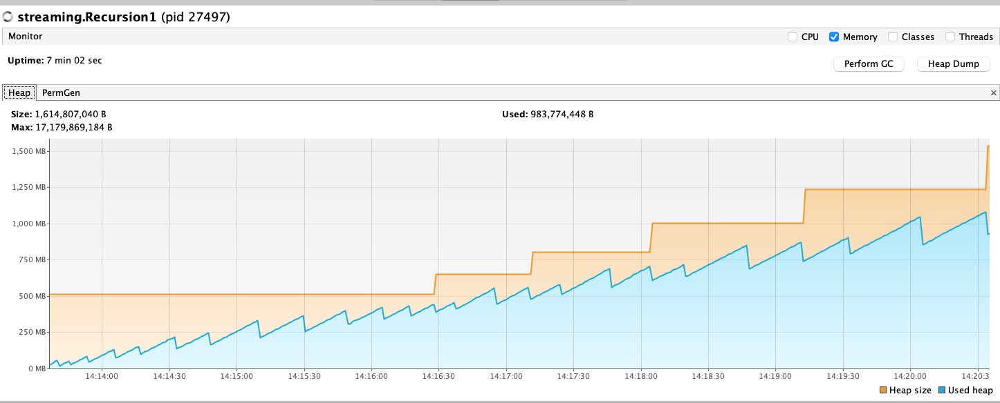

(Note: We have found a solution to this problem. See the "Solution" section if you are interested)

We're having a memory leak problem with a recursion involving fs2.Stream and we don't know
how to fix it. We've isolated the problem and produced an example in this project. We've made
some unsuccessful attempts to avoid the memory leak, but my guess is we're doing something wrong.

We'd appreciate your help.

There is one source file in this project:

# streaming.Recursion

This closely models the real code we're having a problem with.

The idea is that something calls the `readSse` method. This creates connections to
an HTTP server (using passed in `connectionParameters`), getting an `fs2.Stream`.
This is modelled by the `clientStream` function. The stream is read until there is no
more to read (or some error condition occurs, which is not modelled here), and then
a new connection is established (possibly to a different server), with different
connection parameters.

The problem that we're seeing is that this code has a memory leak somewhere. We have minimised
the code as much as we can, including the fact that the stream acquired from the 'client' is
always empty, because the leak occurs due to the 'recursive' call to `reconnect`.

Here is a graph of the memory usage over time:

I'm assuming we're doing something wrong. If anybody can tell me what is is, I'd be grateful.

I've used the fs2 and cats-effect versions that are in use in the production code I'm working on.
But I have tried updating them in this project and it doesn't make a difference.

# Solution

The problem was that we were converting the `Pull` back into a `Stream` and then recursing.
If the recursion returns the `Pull` and then the conversion to a `Stream` happens right at the
end, the memory leak goes away.

See `streaming.RecursionSolution` for the non-leaky code.

And here is a graph of the memory usage over time:

